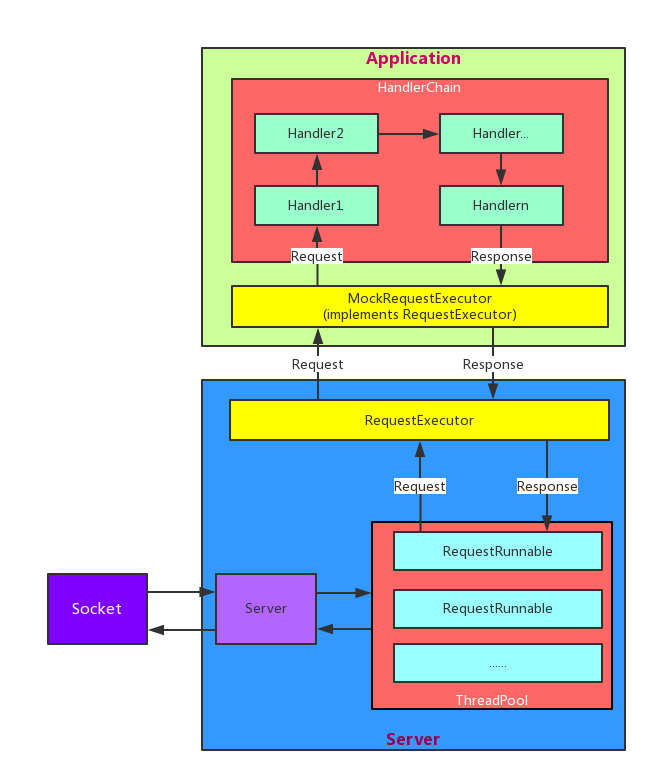

## MockNet使用指南

[English](./proDocs/README-en.md)

### 框架介绍
MockNet 用于快速搭建本地服务器，方便开发和测试接口。不需要任何服务器知识，只需要简单几行代码，就可以搭建一个本地服务器。不需要更改项目中网络访问代码就可以进行接口测试，可以和后台接口同步开发甚至先于后台接口进行开发。

### 下载
Gradle 
``` gradle
// 在模块的 gradle 文件中添加下面的代码  
compile 'com.zy.mocknet:mocknet:1.0'
```

Maven
``` xml
<dependency>
  <groupId>com.zy.mocknet</groupId>
  <artifactId>mocknet</artifactId>
  <version>1.0</version>
  <type>pom</type>
</dependency>
```

jar包下载
[mocknet_1_0_0.jar](./jar/mocknet_1_0_0.jar)

### 使用方法
可参考 [demo](./demo/src/main/java/com/zy/demo/MainActivity.java)  

具体使用步骤如下：

#### 0. 修改访问 ip
修改网络访问地址或 ip 为本地 ip (127.0.0.1:port 或 localhost:port 或 本地具体的ip).  

#### 1. 初始化
``` java
// 创建 MockNet
MockNet mockNet = MockNet.create();
```

#### 2. 添加对请求的处理
MockNet 中，对每一个请求及其响应称为一个 Connection，具体对应的类是 MockConnection。 
项目中提供了多种添加 MockConnection 的方法，如下：

* 通过 MockConnectionFactory 构建一个 MockConnection，createGeneralConnection(String url, String body) 会创建一个处理 GET 请求的 MockConnection，并返回 body，默认 Content-Type 是 "text/plain"。

``` java
MockConnection conn = MockConnectionFactory.getInstance()
    .createGeneralConnection("/*", "general connection");
mockNet.addConnection(conn);
```


* 通过 MockConnectionFactory 构建一个 MockConnection，createGeneralConnection(String method, String url, String body) 会创建一个处理 method 指定的请求的 MockConnection，并返回 body，默认 Content-Type 是 "text/plain"。

``` java
MockConnectio conn = MockConnectionFactory.getInstance()
    .createGeneralConnection(MockConnection.POST, "/*", "general connection");
mockNet.addConnection(conn);
```

* 添加返回 json 的请求处理  
通过 MockConnectionFactory 构建一个 MockConnection，createGeneralConnection(String method, String url, String contentType, String body) 会创建一个处理 method 指定的请求的 MockConnection，并返回 body。  

``` java
MockConnection conn = MockConnectionFactory.getInstance()
    .createGeneralConnection(MockConnection.POST, "/*", "text/json", "{'code':'success'}");
mockNet.addConnection(conn);

```

* 自己构建 MockConnection  
通过 MockConnection.Builder 来创建 MockConnection，添加自定义的返回信息

``` java
MockConnection conn = new MockConnection.Builder()
        .setMethod(MockConnection.GET)
        .setUrl("/test")
        .setResponseBody("text/json", "first test")
        .addResponseHeader("Content-Length", "" + "first test".length())
        .addRequestHeader("Content-Length", "" + con.length)
        .setVerifyHeaders(true)
        .build();
mockNet.addConnection(conn);

// 或者直接传入 builder
MockConnection.Builder builder = new MockConnection.Builder()
        .setMethod(MockConnection.GET)
        .setUrl("/test")
        .setResponseBody("text/json", "first test")
        .addResponseHeader("Content-Length", "" + "first test".length())
        .addRequestHeader("Content-Length", "" + con.length)
        .setVerifyHeaders(true);

mockNet.addConnection(builder);
```

#### 3. 启动服务

``` java
// 使用默认的 8088 端口
mockNet.start();
// 使用指定的端口
mockNet.start(int port);
```

#### 4. 关闭服务

``` java
mockNet.stop();
```

#### 5. 链式调用
以上方法可以用链式调用来写，更方便一些
``` java

MockNet mockNet = MockNet.create()
                .addConnection(MockConnectionFactory.getInstance()
                        .createGeneralConnection("/*", "general connection"))
                .addConnection(MockConnectionFactory.getInstance()
                        .createGeneralConnection(MockConnection.POST, "/*", "general connection"))
                .addConnection(MockConnectionFactory.getInstance()
                        .createGeneralConnection(MockConnection.POST, "/*", "text/json", "{'code':'success'}"))
                .addConnection(new MockConnection.Builder()
                        .setMethod(MockConnection.GET)
                        .setUrl("/test")
                        .setResponseBody("text/json", con, con.length)
                        .addResponseHeader("Content-Length", "" + con.length)
                        .addRequestHeader("Content-Length", "" + con.length)
                        .setVerifyHeaders(true)
                )
                .start();
```

### 进阶使用

#### 1. 自定义 MockConnection 的使用
通过 MockConnection.Builder 生成 Builder，并通过 Builder 相关方法构建 MockConnection。Builder 常用的方法可以参看文档:[Builder](https://5a59.github.io/MockNet/proDocs/javadoc/index.html)

#### 2. 随机对请求做出响应
MockNet 内部通过 url 和 method(GET，POST等)来对请求做出区分，在 addConnection 时如果添加了相同的 url 和 method 的 MockConnection，会通过 IConnectionSelector 来选择其中之一进行返回，默认使用 RandomSelector 随机返回。
可以通过 实现 IConnectionSelector 接口并通过 MockNet.setSelector() 设置返回规则

#### 3. Log 设置
默认对每个 MockConnection 都会输出 Log 以帮助调试，如果想关闭 Log，可以在构建 MockConnection 时设置 isLog(false)

MockNet 的 Log 输出是由 Logger 和 Printer 完成的，默认设置了 AndroidPrinter 和 JavaPrinter，如果想自定义 Log，可以实现 Printer 接口，并调用 Logger.init(yourPrinter) 设置，但是要在调用了 MockConnection.create() 之后，否则设置会被覆盖为默认设置

#### 4. 自定义 Handler 对请求响应进行处理
MockNet 中对 Request 和 Response 的处理采用了责任链模式(具体可查看整体架构中的介绍)，通过添加 Handler 增加处理环节，框架自带的 Handler 有 BlockHandler，LogHandler，VerifyHeaderHandler，VerifyParamHandler，ConnectionHandler。
如果想增加自己的处理环节，请实现 Handler 接口，并通过 MockNet.addHandler(Handler h) 来设置。具体实现方法可参照框架默认实现的 Handler 代码。

#### 5. 支持 https
支持 https 可以通过下面代码来开启:
``` java
MockNet mockNet = MockNet.create();
mockNet.start(ServerSocketFactory.createHttpsServerSocket(int port, String jksPath, String storePwd));
```

#### 6. 动态处理数据
为了简化使用方法和加快开发速度，默认只支持返回静态数据，暂时没有对数据进行动态处理。如果想动态处理请求数据，可以继承 RequestExecutor 接口并实现 execute 方法。在 execute 方法中对请求进行动态处理，并创建 Reponse 返回。
之后通过 Server 构造函数构造 Server 对象并传入实现 RequestExecutor 接口的类对象。
具体可以参考 MockRequestExecutor 的实现以及 Server 构造函数。

### 整体架构简析 
  

* 整体架构可以分为两层，server 层和 application 层。
* server 层主要做的是 socket 通信以及 Request 和 Response 的解析，解析结果会传入 RequestExecutor 中做处理。
* application 层主要是对 request 的处理和对 response 的生成，MockRequestExecutor 实现了 RequestExecutor 接口，其中主要通过责任链模式来对 Request 处理。

### 其他
有关项目 bug 反馈或者希望项目增加什么功能或者单纯想和我交流，欢迎邮件交流或者添加 issue。   
邮箱: zy5a59@outlook.com
