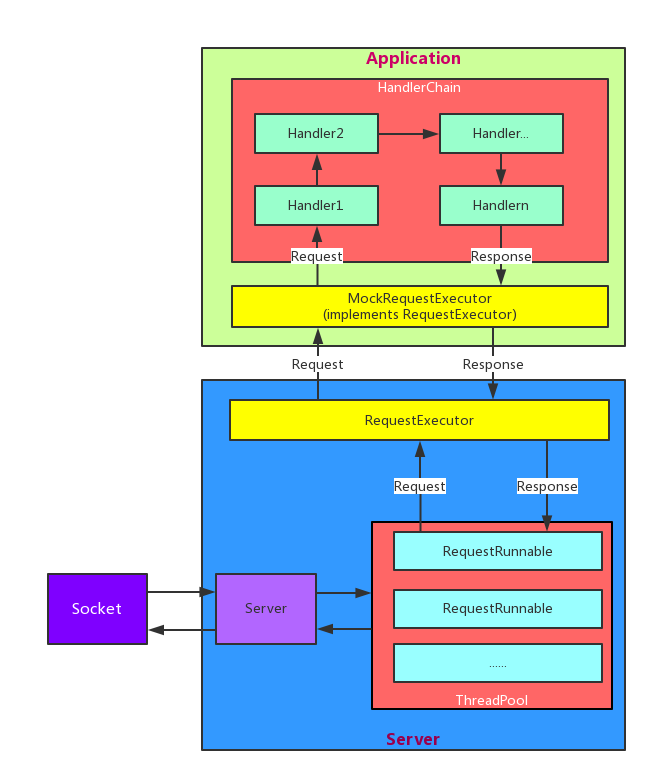

## MockNet User Guide

### Introduction
MockNet is used to build a local server on Android quickly. It makes it easy for development and testing of network interface. You can build a local server with several lines of code without any knowledge of server development.

### Download
Gradle 
``` gradle
// add this line to gradle file
compile 'com.zy.mocknet:mocknet:1.0'
```

Maven
``` xml
<dependency>
  <groupId>com.zy.mocknet</groupId>
  <artifactId>mocknet</artifactId>
  <version>1.0</version>
  <type>pom</type>
</dependency>
```

Download jar file 
[mocknet_1_0_0.jar](./jar/mocknet_1_0_0.jar)

### How to use
[demo](./demo/src/main/java/com/zy/demo/MainActivity.java)  

You can use it just with several steps.

#### 0. Modify the ip
Modyfy the netwrok address for local ip (127.0.0.1:port).

#### 1. Init
``` java
// Create a MockNet instance
MockNet mockNet = MockNet.create();
```

#### 2. Add the processing of the request
Each request and its response is called a MockConnection.
There are several ways to add a MockConnection.

* Using MockConnectionFactory class to create a MockConnection instance. The method createGeneralConnection(String url, String body) will create a MockConnection that handles GET requests and returns body, and the Content-Type is "text/plain"。

``` java
MockConnection conn = MockConnectionFactory.getInstance()
    .createGeneralConnection("/*", "general connection");
mockNet.addConnection(conn);
```

* Using MockConnectionFactory class to create a MockConnection instance. The method createGeneralConnection(String url, String body) will create a MockConnection that handles requests with the specific method and returns body, and the Content-Type is "text/plain"。

``` java
MockConnectio conn = MockConnectionFactory.getInstance()
    .createGeneralConnection(MockConnection.POST, "/*", "general connection");
mockNet.addConnection(conn);
```

* Add response with json

``` java
MockConnection conn = MockConnectionFactory.getInstance()
    .createGeneralConnection(MockConnection.POST, "/*", "text/json", "{'code':'success'}");
mockNet.addConnection(conn);
```

* Create MockConnection with more data
You can create MockConnection with Builder and append more data.

``` java
MockConnection conn = new MockConnection.Builder()
        .setMethod(MockConnection.GET)
        .setUrl("/test")
        .setResponseBody("text/json", "first test")
        .addResponseHeader("Content-Length", "" + "first test".length())
        .addRequestHeader("Content-Length", "" + con.length)
        .setVerifyHeaders(true)
        .build();
mockNet.addConnection(conn);

// Or
MockConnection.Builder builder = new MockConnection.Builder()
        .setMethod(MockConnection.GET)
        .setUrl("/test")
        .setResponseBody("text/json", "first test")
        .addResponseHeader("Content-Length", "" + "first test".length())
        .addRequestHeader("Content-Length", "" + con.length)
        .setVerifyHeaders(true);

mockNet.addConnection(builder);
```

#### 3. Start the server

``` java
// use the default port : 8088 
mockNet.start();
// specify the port
mockNet.start(int port);
```

#### 4. Stop the server

``` java
mockNet.stop();
```

#### 5. Chain style
Using chain style to simplify the code.
``` java

MockNet mockNet = MockNet.create()
                .addConnection(MockConnectionFactory.getInstance()
                        .createGeneralConnection("/*", "general connection"))
                .addConnection(MockConnectionFactory.getInstance()
                        .createGeneralConnection(MockConnection.POST, "/*", "general connection"))
                .addConnection(MockConnectionFactory.getInstance()
                        .createGeneralConnection(MockConnection.POST, "/*", "text/json", "{'code':'success'}"))
                .addConnection(new MockConnection.Builder()
                        .setMethod(MockConnection.GET)
                        .setUrl("/test")
                        .setResponseBody("text/json", con, con.length)
                        .addResponseHeader("Content-Length", "" + con.length)
                        .addRequestHeader("Content-Length", "" + con.length)
                        .setVerifyHeaders(true)
                )
                .start();
```

### Advanced

#### 1. Create MockConnection by yourself
Using MockConnection.Builder to create MockConnection。
You can find message about Builder here: [Builder](https://5a59.github.io/MockNet/proDocs/javadoc/index.html)

#### 2. Choose response randomly
MockNet use url and method to distinguish reqeust. If you add more than one MockConnections with the same url and method, it will choose response from them by IConnectionSelector. MockNet achieves a RandomSelector, so it chooses response randomly by default.
You can create class implements IConnectionSelector to choose response.

#### 3. Set Log by yourself 
MockConnectino will output log by default, you can call isLog(false) when creating MockConnection to close log.
You can also create class implements Printer and call Logger.init(yourPrinter) to change the behave of logger.

#### 4. Create Handler to handle request 
MockNet uses Chain-of-responsibility pattern to handle request and response. It has some default handlers like BlockHandler, LogHandler, VerifyHeaderHandler, VerifyParamHandler and ConnectionHandler. 
You can create class implements Handler to handle request and response.

#### 5. Support https
You can use the codes below to support https.
``` java
MockNet mockNet = MockNet.create();
mockNet.start(ServerSocketFactory.createHttpsServerSocket(int port, String jksPath, String storePwd));
```

#### 6. Handle request dynamically  
You can handle request dynamically by creating class implements RequestExecutor. Tnen you can set it by the constructor of Server.
You can read the code of MockRequestExecutor to learn more.

### framework 
  

* There are two parts of MockNet,server and application.
* The part of server handles the socket and parses the request and response. Then it sends the request to RequestExecutor and receive response. Then it sends the response to client through the socket.
* The part of application handles the request and creates the response. The MockRequestExecutor class implements the RequestExecutor interface. It handles request using Chain-of-responsibility pattern.

### Other
email: zy5a59@outlook.com
